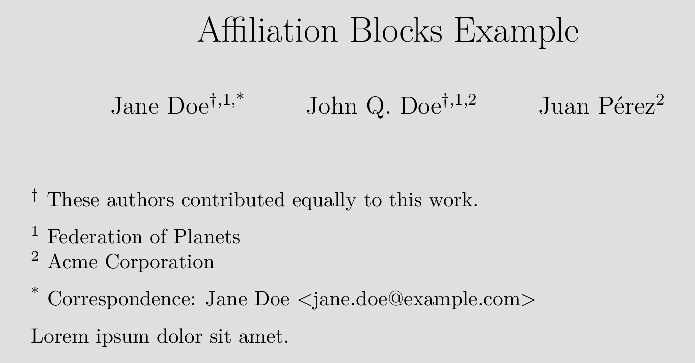

# author-info-blocks

This filter adds author-related header blocks usually included in
scholarly articles, such as a list of author affiliations,
correspondence information, and on notes equal contributors.


## Dependencies

This filter assumes metadata in the canonical format generated by
the [scholarly-metadata filter](../scholarly-metadata).

## Usage

The filter should be run after *scholarly-metadata.lua*:

    pandoc --lua-filter=scholarly-metadata/scholarly-metadata.lua \
           --lua-filter=author-info-blocks/author-inffo-blocks.lua \
           --output=outfile.pdf --pdf-engine=xelatex \
           article.md

The ways in which affiliation data should be given is described
in the docs for **scholarly-metadata.lua*. Additionally, authors
who contributed equally to an article can be marked by adding
`equal_contributor: yes` to the respective YAML objects.
Similarly, corresponding authors should be marked with
`correspondence: yes` and have an `email` listed.

### Example

Take the following example YAML block:

``` yaml
---
title: Affiliation Blocks Example 
author:
  - Jane Doe:
      institute:
        - federation
      equal_contributor: "yes"
      correspondence: "yes"
      email: jane.doe@example.com
  - John Q. Doe:
      institute: [federation, acme]
      equal_contributor: "yes"
  - Juan Pérez:
      institute: acme
institute:
  - federation: Federation of Planets
  - acme:
      name: Acme Corporation
---
```

This will mark Jane Doe and John Q. Doe as equal contributors and
Jane Doe as the sole corresponding author. Below is a screenshot
of a document header created from this metadata.


