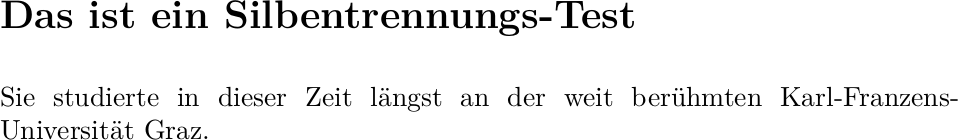
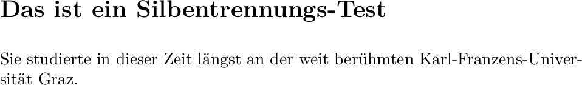

# latex-hyphen.lua

`latex-hyphen.lua` is a [pandoc](https://pandoc.org/) filter that replaces
intra-word hyphens with the raw LaTeX expression `"=` for improved
hyphenation.

## Purpose

The regular hyphen `-` prevents LaTeX from breaking a word at any other
position than the explicit hyphen. With long, hyphenated words as they occur
in languages like German, this can lead to undesirable visual results. The
expression `"=` outputs a normal hyphen while still allowing LaTeX to break
the word at any other position according to its regular hyphenation rules.

Before:



After:



## Usage

For this to work, babel shorthands have to be activated. With XeLaTeX or
LuaTeX as PDF engine, this can be done using the YAML frontmatter:

```yaml
polyglossia-lang:
    name: german
    options:
        - spelling=new,babelshorthands=true

```

For pdflatex, a custom template has to be used, as the built-in template
explicitly deactivates babel’s shorthands.

The filter can then be called like this:

```sh
pandoc -o mydoc.pdf --pdf-engine xelatex \
    --lua-filter latex-hyphen.lua mydoc.md
```

## Caveat

pandoc strips LaTeX expressions from PDF strings like bookmarks. Thus, the
document outline in the resulting PDF file will lack any hyphens.
