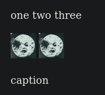

# Support for figures in Markdown

This filter provides two syntaxs to represent figures in markdown.

## Explicit syntax

The explicit syntax is constructed using a `div` with "figure" class. The
caption is also specified using a `div` but with a "caption" class.

Here is an example.

```
::: { .figure }

content.

:::: {.caption }
caption
::::

:::
```

All elements inside the figure that are an image without a caption in its own
paragraph become html's `img` tags.

Here is an example of figure containing two images and a caption.

```{markdown}
::: { .figure }


:::: {.caption }
caption
::::

:::
```

This will result in a single figure containing multiple images.

```
$ pandoc -f markdown -t native --lua-filter=md-figure-explicit.lua fig-explicit.md

[Figure ("",[],[]) (Caption (Just []) [Para [Str "caption"]])
	[ Plain [Image ("",[],[]) [] ("test/media/rId25.jpg","")]
	, Plain [Image ("",[],[]) [] ("test/media/rId25.jpg","")]]]
```


```{html}
<figure>


<figcaption><p>caption</p></figcaption>
</figure>
```

This will result in a single figure containing multiple images.

## Implicit syntax

The second syntax uses the last paragraph inside the figure as the caption.

```{markdown}
::: { .figure }


This is a caption with
multiple lines

:::

```

This results in the following output:


```
$ pandoc -f markdown -t native --lua-filter=md-figure-implicit.lua fig-implict.md
[Figure ("",[],[])
	(Caption
		(Just [])
		[ Para [Str "This",Space,Str "is",Space,Str "a",Space,Str "caption",Space,Str "with",SoftBreak,Str "multiple",Space,Str "lines"]]) 
	[Plain [Image ("",[],[]) [] ("test/media/rId25.jpg","")],Plain [Image ("",[],[]) [] ("test/media/rId25.jpg","")]]]
```

```{html}
<figure>


<figcaption><p>This is a caption with multiple lines</p></figcaption>
</figure>
```

## Sample Firefox's HTML rendering

For the implicit syntax example, this is firefox's render.


