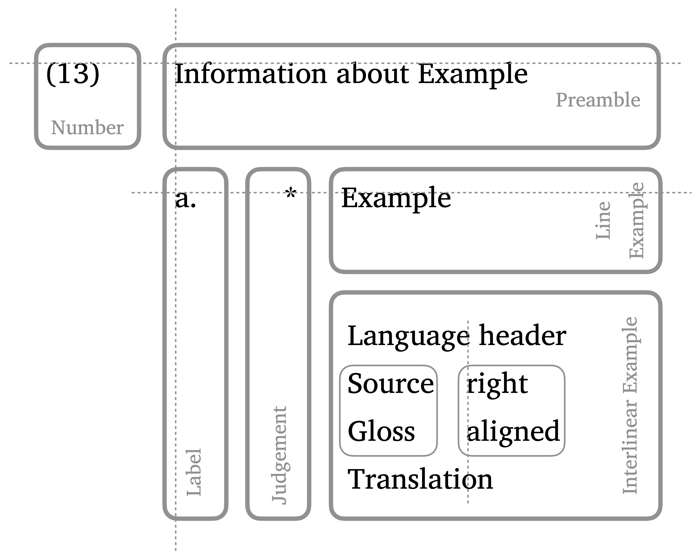

# pandoc-ling

*Michael Cysouw* \<<cysouw@mac.com>\>

A Pandoc filter for linguistic examples

tl;dr

-   Easily write linguistic examples including basic interlinear
    glossing.
-   Let numbering and cross-referencing be done for you.
-   Export to (almost) any format of your wishes for final polishing.

# Rationale

In the field of linguistics there is an outspoken tradition to format
example sentences in research papers in a very specific way. In the
field, it is a perennial problem to get such example sentences to look
just right. Within Latex, there are numerous packages to deal with this
problem (e.g. covington, linguex, gb4e, expex, etc.). Depending on your
needs, there is some Latex solution for almost everyone. However, these
solutions in Latex are often cumbersome to type, and they are not
portable to other formats. Specifically, transfer between Latex, html,
docx, odt or epub would actually be highly desirable. Such transfer is
the hallmark of [Pandoc](https://pandoc.org), a tool by John MacFarlane
that provides conversion between these (and many more) formats.

Any such conversion between text-formats naturally never works
perfectly: every text-format has specific features that are not
transferable to other formats. A central goal of Pandoc (at least in my
interpretation) is to define a set of shared concepts for text-structure
(a 'common denominator' if you will, but surely not 'least'!) that can
then be mapped to other formats. In many ways, Pandoc tries (again) to
define a set of logical concepts for text structure ('semantic markup'),
which can then be formatted by your favorite typesetter. As long as you
stay inside the realm of this 'common denominator' (in practice that
means Pandoc's extended version of Markdown/CommonMark), conversion
works reasonably well (think 90%-plus).

Building on John Gruber's [Markdown
philosophy](https://daringfireball.net/projects/markdown/syntax), there
is a strong urge here to learn to restrain oneself while writing, and
try to restrict the number of layout-possibilities to a minimum. In this
sense, with `pandoc-ling` I propose a Markdown-structure for linguistic
examples that is simple, easy to type, easy to read, and portable
through the Pandoc universe by way of an extension mechanism of Pandoc,
called a 'Pandoc Lua Filter'. This extension will not magically allow
you to write every linguistic example thinkable, but my guess is that in
practice the present proposal covers the majority of situations in
linguistic publications (think 90%-plus). As an example (and test case)
I have included automatic conversions into various formats in this
repository (chech them out to get an idea of the strengths and
weaknesses of this approach).

# The basic structure of a linguistic example

Basically, a linguistic examples consists of 6 possible building blocks,
of which only the number and at least one example line are necessary.
The space between the building blocks is kept as minimal as possible
without becoming cramped. When (optional) building blocks are not
included, then the other blocks shift left and up (only exception: a
preamble without labels is not shifted left completely, but left-aligned
with the example, not with the judgement).

-   **Number**: Running tally of all examples in the work, possibly
    restarting at chapters or other major headings. Typically between
    round brackets, possibly with a chapter number added before in long
    works, e.g. example (7.26). Aligned top-left, typically left-aligned
    to main text margin.
-   **Preamble**: Optional information about the content/kind of
    example. Aligned top-left: to the top with the number, to the left
    with the (optional) label. When there is no label, then preamble is
    aligned with the example, not with the judgment.
-   **Label**: Indices for sub-examples. Only present when there are
    more than one example grouped together inside one numbered entity.
    Typically these sub-example labels use latin letters followed by a
    full stop. They are left-aligned with the preamble, and each label
    is top-aligned with the top-line of the corresponding example
    (important for longer line-wrapped examples).
-   **Judgment**: Examples can optionally have grammaticality judgments,
    typically symbols like \*\*?!\* sometimes in superscript relative to
    the corresponding example. judgements are right-aligned to each
    other, typically with only minimal space to the left-aligned
    examples.
-   **Line example**: A minimal linguistic example has at least one line
    example, i.e. an utterance of interest. Building blocks in general
    shift left and up when other (optional) building blocks are not
    present. Minimally, this results in a number with one line example.
-   **Interlinear example**: A complex structure typically used for
    examples from languages unknown to most readers. Consist of three or
    four lines that are left-aligned:
    -   **Header**: An optional header is typically used to display
        information about the language of the example, including
        literature references. When not present, then all other lines
        from the interlinear example shift upwards.
    -   **Source**: The actual language utterance, often typeset in
        italics. This line is internally separated at spaces, and each
        sub-block is left-aligned with the corresponding sub-blocks of
        the gloss.
    -   **Gloss**: Explanation of the meaning of the source, often using
        abbreviations in small caps. This line is internally separated
        at spaces, and each block is left-aligned with the block from
        source.
    -   **Translation**: Free translation of the source, typically
        quoted. Not separated in blocks, but freely extending to the
        right. Left-aligned with the other lines from the interlinear
        example.



There are of course much more possibilities to extend the structure of a
linguistic examples, like third or fourth subdivisions of labels (often
using small roman numerals as a third level) or multiple glossing lines
in the interlinear example. Also, the content of the header is sometimes
found right-aligned to the right of the interlinear example (language
into to the top, reference to the bottom). All such options are
currently not supported by `pandoc-ling`.

Under the hood, this structure is prepared by `pandoc-ling` as a table.
Tables are reasonably well transcoded to different document formats.
Specific layout considerations mostly have to be set manually. Alignment
of the text should work in most exports. Some `CSS` styling is proposed
by `pandoc-ling`, but can of course be overruled.

# Introducing `pandoc-ling`

## Editing linguistic examples

To include a linguistic example in Markdown `pandoc-ling` uses the `div`
structure, which is indicated in Pandoc-Markdown by typing three colons
at the start and three colons at the end. To indicate the `class` of
this `div` the letters 'ex' (for 'example') should be added after the
top colons (with or without space in between). This 'ex'-class is the
signal for `pandoc-ling` to start processing such a `div`. The numbering
of these examples will be inserted by `pandoc-ling`.

Empty lines can be added inside the `div` for visual pleasure, as they
mostly do not have an influence on the output. Exception: do *not* use
empty lines between unlabeled line examples. Multiple lines of text can
be used (without empty lines in between), but they will simply be
interpreted as one sequential paragraph.

    ::: ex
    This is the most basic structure of a linguistic example. 
    :::

::: ex
This is the most basic structure of a linguistic example. 
:::

Alternatively, the `class` can be put in curled brackets (and then a
leading full stop is necessary before `ex`). Inside these brackets more
attributes can be added (separated by space), for example an id, using a
hash, or any attribute=value pairs that should apply to this example.
Currently there is only one attribute implemented (`formatGloss`), but
in principle it is possible to add more attributes that can be used to
fine-tune the typesetting of the example.

    ::: {#id .ex formatGloss=false}

    This is a multi-line example.
    But that does not mean anything for the result
    All these lines are simply treated as one paragraph.
    They will become one example with one number.

    :::

::: {#id .ex formatGloss=false}

This is a multi-line example.
But that does not mean anything for the result
All these lines are simply treated as one paragraph.
They will become one example with one number.

:::

A preamble can be added by inserting an empty line between preamble and
example. The same considerations about multiple text-lines apply.

    :::ex
    Preamble

    This is an example with a preamble.
    :::

:::ex
Preamble

This is an example with a preamble.
:::

Sub-examples with labels are entered by starting each sub-example with a
small latin letter and a full stop. Empty lines between labels are
allowed. Subsequent lines without labels are treated as one paragraph.
Empty lines *not* followed by a label with a full stop will result in
errors.

    :::ex
    a. This is the first example.
    b. This is the second.
    a. The actual letters are not important, `pandoc-ling` will put them in order.

    e. Empty lines are allowed between labelled lines
    Subsequent lines are again treated as one sequential paragraph.
    :::

:::ex
a. This is the first example.
b. This is the second.
a. The actual letters are not important, `pandoc-ling` will put them in order.

e. Empty lines are allowed between labelled lines
Subsequent lines are again treated as one sequential paragraph.
:::

A labelled list can be combined with a preamble.

    :::ex
    Any nice description here

    a. one example sentence.
    b. two
    c. three
    :::

:::ex
Any nice description here

a. one example sentence.
b. two
c. three
:::

Grammaticality judgements should be added before an example, and after
an optional label, separated from both by spaces (though four spaces in
a row should be avoided, that could lead to layout errors). To indicate
that any sequence of symbols is a judgements, prepend the judgement with
a caret `^`. Alignment will be figured out by `pandoc-ling`.

    :::ex
    Throwing in a preamble for good measure

    a. ^* This traditionally signals ungrammaticality.
    b. ^? Question-marks indicate questionable grammaticality.
    c. ^^whynot?^ But in principle any sequence can be used (here even in superscript).
    d. However, such long sequences sometimes lead to undesirable effects in the layout.
    :::

:::ex
Throwing in a preamble for good measure

a. ^* This traditionally signals ungrammaticality.
b. ^? Question-marks indicate questionable grammaticality.
c. ^^whynot?^ But in principle any sequence can be used (here even in superscript).
d. However, such long sequences sometimes lead to undesirable effects in the layout.
:::

A minor detail is the alignment of a single example with a preamble and
grammaticality judgements. In this case it looks better for the preamble
to be left aligned with the example and not with the judgement.

    :::ex
    Here is a special case with a preamble

    ^^???^ With a singly questionably example.
    Note the alignment! Especially with this very long example
    that should go over various lines in the output.
    :::

:::ex
Here is a special case with a preamble

^^???^ With a singly questionably example.
Note the alignment! Especially with this very long example
that should go over various lines in the output.
:::

## Interlinear examples

For interlinear examples with aligned source and gloss, the structure of
a `lineblock` is used, starting the lines with a vertical line `|`.
There should always be four vertical lines (for header, source, gloss
and translation, respectively), although the content after the first
vertical line can be empty. The source and gloss lines are separated at
spaces, and all parts are right-aligned. If you want to have a space
that is not separated, you will have to 'protect' the space, either by
putting a backslash before the space, or by inserting a non-breaking
space instead of a normal space (either type `&nbsp;` or insert an
actual non-breaking space, i.e. unicode character `U+00A0`).

    :::ex
    | Dutch (Germanic)
    | Deze zin is in het nederlands.
    | DEM sentence AUX in DET dutch.
    | This sentence is dutch.
    :::

:::ex
| Dutch (Germanic)
| Deze zin is in het nederlands.
| DEM sentence AUX in DET dutch.
| This sentence is dutch.
:::

An attempt is made to format interlinear examples when the option
`formatGloss=true` is added. This will:

-   remove formatting from the source and set everything in italics,
-   remove formatting from the gloss and set sequences (\>1) of capitals
    and numbers into small caps (note that the positioning of small caps
    on web pages is [highly
    complex](https://iamvdo.me/en/blog/css-font-metrics-line-height-and-vertical-align)),
-   a tilde `~` between spaces in the gloss is treated as a shortcut for
    an empty gloss (internally, the sequence `space-tilde-space` is
    replaced by `space-space-nonBreakingSpace-space-space`),
-   consistently put translations in single quotes, possibly removing
    other quotes.

```{=html}
<!-- -->
```
    ::: {.ex formatGloss=true}
    | Dutch (Germanic)
    | Deze zin is in het nederlands.
    | DEM sentence AUX in DET dutch.
    | This sentence is dutch.
    :::

::: {.ex formatGloss=true}
| Dutch (Germanic)
| Deze zin is in het nederlands.
| DEM sentence AUX in DET dutch.
| This sentence is dutch.
:::

The results of such formatting will not always work, but it seems to be
quite robust in my testing. The next example brings everything together:

-   a preamble,
-   labels, both for single lines and for interlinear examples,
-   interlinear examples start on a new line immediately after the
    letter-label,
-   grammaticality judgements with proper alignment,
-   when the header of an interlinear example is left out, everything is
    shifted up,
-   The formatting of the interlinear is harmonized.

```{=html}
<!-- -->
```
    ::: {.ex formatGloss=true}
    Completely superfluous preamble, but it works ...

    a. Mixing single line examples with interlinear examples.
    a. This is of course highly unusal.
    Just for this example, let's add some extra material in this example.

    a.
    | Dutch (Germanic) Note the grammaticality judgement!
    | ^^:-)^ Deze zin is (dit\ is&nbsp;test) nederlands.
    | DEM sentence AUX ~ dutch.
    | This sentence is dutch.

    b.
    |
    | Deze tweede zin heeft geen header.
    | DEM second sentence have.3SG.PRES no header.
    | This second sentence does not have a header.
    :::

::: {.ex formatGloss=true}
Completely superfluous preamble, but it works ...

a. Mixing single line examples with interlinear examples.
a. This is of course highly unusal.
Just for this example, let's add some extra material in this example.

a.
| Dutch (Germanic) Note the grammaticality judgement!
| ^^:-)^ Deze zin is (dit\ is&nbsp;test) nederlands.
| DEM sentence AUX ~ dutch.
| This sentence is dutch.

b.
|
| Deze tweede zin heeft geen header.
| DEM second sentence have.3SG.PRES no header.
| This second sentence does not have a header.
:::

## Cross-referencing examples

The examples are automatically numbered by `pandoc-ling`.
Cross-references to examples can be made by using the `[@ID]` format
(used by Pandoc for citations). When an example has an explicit
identifier (like `#test` in the next example), then a reference can be
made to this example with `[@test]`, leading to [@test] when formatted.

    ::: {#test .ex}
    This is a test
    :::

::: {#test .ex}
This is a test
:::

Inspired by the `linguex`-approach, you can also use the keywords `Next`
or `Last` to refer to the next or the last example, e.g. `[@Last]` will
be formatted as [@Last]. By doubling the capitals to `NNext` or `LLast`
reference to the next/last-but-one can be made. Actually, the number of
starting capitals can be repeated at will in `pandoc-ling`, so something
like `[@LLLLLLLLast]` will also work. It will be formatted as
[@LLLLLLLLast] after the processing of `pandoc-ling`. Needless to say
that in such a situation an explicit identifier would be a better
choice.

Referring to sub-examples can be done by manually adding a suffix into
the cross reference, simply separated from the identifier by a space.
For example, `[@LLast c]` will refer to the third sub-example of the
last-but-one example. Formatted this will look like this: [@LLast c],
smile! However, note that the "c" has to be manually determined. It is
simply a literal suffix that will be copied into the cross-reference.
Something like `[@LLast Ha1l0]` will work also, leading to [@LLast
Ha1l0] when formatted (which is of course nonsensical).

## Options of `pandoc-ling`

### Global options

The following global options are available with `pandoc-ling`. These can
be added to the [Pandoc
metadata](https://pandoc.org/MANUAL.html#metadata-blocks). An example of
such metadata can be found at the bottom of this `readme` in the form of
a YAML-block. Pandoc allows for various methods to provide metadata (see
the link above).

-   **`formatGloss`** (boolean, default `false`): should all interlinear
    examples be consistently formatted? If you use this option, you can
    simply use capital letters for abbreviations in the gloss, and they
    will be changed to small caps. The source line is set to italics,
    and the translations is put into single quotes.
-   **`xrefSuffixSep`** (string, defaults to no-break-space): When cross
    references have a suffix, how should the separator be formatted? The
    defaults 'no-break-space' is a safe options, but I personally like a
    'thin space' better (Unicode `U+2009`), but symbol does not work
    with many fonts, and might lead to errors. For Latex typesetting,
    all space-like symbols are converted to a Latex thin space `\,`.
-   **`restartAtChapter`** (boolean, default `false`): should the
    counting restart for each chapter? Actually, when `true` this
    setting will restart the counting at the highest heading level,
    which for various output formats can be set by the Pandoc option
    `top-level-division`. Depending on your Latex setup, an explicit
    entry `top-level-division: chapter` might be necessary in your
    metadata.
-   **`addChapterNumber`** (boolean, default `false`): should the
    chapter (= highest heading level) number be added to the number of
    the example? In most formats this automatically implies
    `restartAtChapter: true`. In most Latex situations this only works
    in combination with a `documentclass: book`.
-   **`latexPackage`** (one of: `linguex`, `gb4e`, `langsci-gb4e`,
    `expex`, default `linguex`): Various options for converting examples
    to Latex packages that typeset linguistic examples. None of the
    conversions works perfectly, though in should work in most normal
    situations (think 90%-plus). It might be necessary to first convert
    to `Latex` and then typeset. Using the direct option insider Pandoc
    might also work in many situations.

### Local options

Local options are options that can be set for each individual example.
Currently only the `formatGloss` option can be used to have an
individual example be formatted differently from the global setting. For
example, when the global setting is `formatGloss: true` in the metadata,
then adding `formatGloss=false` in the curly brackets of a specific
example will block the formatting. This is especially useful when the
automatic formatting does not give the desired result.

## Issues with `pandoc-ling`

-   Manually provided identifiers for examples should not be purely
    numerical (so do not use e.g. `#5789`). In some situation this
    interferes with the setting of the cross-references.
-   Because the cross-references use the same structure as citations in
    Pandoc, the processing of citations (by `citeproc`) should be
    performed **after** the processing by `pandoc-ling`. Further,
    [`pandoc-crossref`](https://github.com/lierdakil/pandoc-crossref),
    another Pandoc extension for numbering figures and other captions,
    also uses the same system. From experience, it seems safer to put
    `pandoc-crossref` **before** `pandoc-ling` in the order of
    processing (though I have no idea why).
-   Interlinear examples will will not wrap at the end of the page.
    There is no solution yet for longer examples that are longer than
    the size of the page.
-   When exporting to `docx` there is a problem because there are
    paragraphs inserted after tables, which adds space in lists with
    multiple interlinear examples. This is [by
    design](https://answers.microsoft.com/en-us/msoffice/forum/msoffice_word-mso_windows8-mso_2013_release/how-to-remove-extra-paragraph-after-table/995b3811-9f55-4df1-bbbc-9f672b1ad262).
    The official solution is to set font-size to 1 for this paragraph
    inside MS Word.
-   Multi-column cells are crucial for `pandoc-ling` to work properly.
    These are only introduced in new table format with Pandoc 2.10 (so
    older Pandoc version are not supported). Also note that these
    structures are not yet exported to all formats, e.g. it will not be
    displayed correctly in `docx`. However, this is currently an area of
    active development
-   `langsci-gb4e` is only available as part of the [`langsci`
    package](https://ctan.org/pkg/langsci?lang=en). You have to make it
    available to Pandoc, e.g. by adding it into the same directory as
    the pandoc-ling.lua filter. I have added a recent version of
    `langsci-gb4e` here for convenience, but this one might be outdated
    at some time in the future.

## A note on Latex conversion

Originally, I decided to write this filter as a two-pronged conversion,
making a markdown version myself, but using a mapping to one of the many
latex libraries for linguistics examples as a quick fix. I assumed that
such a mapping would be the easy part. However, it turned out that the
mapping to latex was much more difficult that I anticipated. Basically,
it turned out that the 'common denominator' that I was aiming for was
not necessarily the 'common denominator' provided by the latex packages.
I worked on mapping to various packages (linguex, gb4e, langsci-gb4e and
expex) with growing dismay. This approach resulted in a first version.
However, after this version was (more or less) finished, I realised that
it would be better to first define the 'common denominator' more clearly
(as done here), and then implement this purely in Pandoc. From that
basis I have then made attempts to map them to the various latex
packages.

## A note on implementation

The basic structure of the examples are transformed into Pandoc tables.
Tables are reasonably safe for converting in other formats. Care has
been taken to add `classes` to all elements of the tables (e.g. the
preamble has the class `linguistic-example-preamble`). When exported
formats are aware of these classes, they can be used to fine-tune the
formatting. I have used a few such fine-tunings into the html output of
this filter by adding a few CSS-style statements. The naming of the
classes is quite transparent, using the form `linguistic-example-...`.
