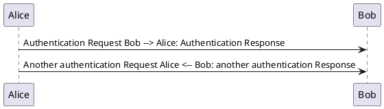

# PlantUML Pandoc filter
PlantUML Pandoc filter to process code blocks with class "plantuml" containing PlantUML notation into images.

* For textual output formats, use --extract-media=DIR
* For HTML formats, you may alternatively use --self-contained

## Example in markdown-file

## Run pandoc
```
pandoc --self-contained --lua-filter=plantuml.lua readme.md -o output.htm
```

## Prerequisites
* install PlantUML from http://plantuml.com (needs JAVA)
* change path to plantuml.jar in plantuml.lua


This script based on the example "Converting ABC code to music notation" from https://pandoc.org/lua-filters.html

This script was only tested with markdown to html on a windows environment!
