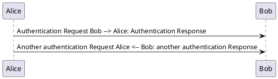

# PlantUML Pandoc filter
PlantUML Pandoc filter to process code blocks with class "plantuml" containing PlantUML notation into images.

* For textual output formats, use --extract-media=DIR
* For HTML formats, you may alternatively use --self-contained

## Example in markdown-file

## Run pandoc
```
pandoc --self-contained --lua-filter=plantuml.lua readme.md -o output.htm
```

## Prerequisites
* download PlantUML from http://plantuml.com (needs JAVA)
* 3 ways to set the environment
    1. plantuml.lua and plantuml.jar in the same folder and start pandoc always from this folder
    2. set a Environment Variable PLANTUML with the path to plantuml.jar
        * Windows - with powershell: Set-Item env:PLANTUML "c:\bin\plantuml.jar"
    3. change path to plantuml.jar in plantuml.lua


This script based on the example "Converting ABC code to music notation" from https://pandoc.org/lua-filters.html

This script was only tested with markdown to html on a windows environment!
